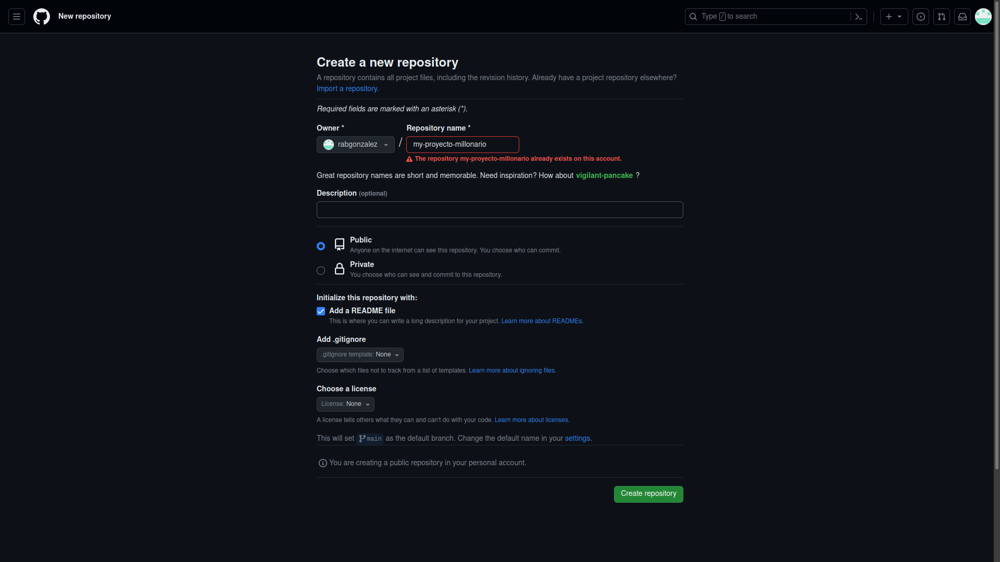
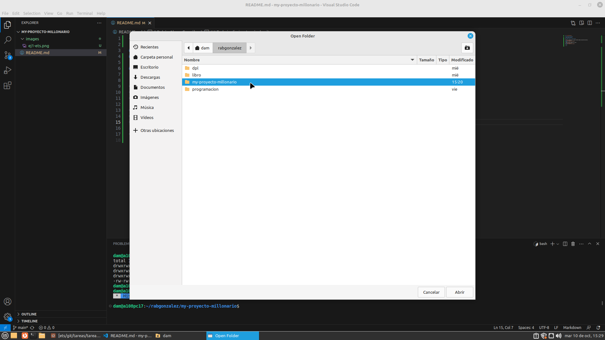

<div align="justify">

# my-proyecto-millonario
### Rubén Abreu González

---

## Trabajo diario a través de git
- Crear un repositorio en vuestro GitHub llamado my-proyecto-millonario.
<div align="justify">

</div>

- Clonar vuestro repositio en local.
- git clone <b>git@github.com:alumno-rabgonzalez/my-proyecto-millonario.git</b>
<div align="justify">

</div>

---

## README
Crear (si no lo habéis creado ya) en vuestro repositorio local un documento <b>README.md.</b>
- touch README.md
<details>
<summary>salida</summary>

```
```
</details>

---

## Commit inicial 

Añadir al README.md los comanddos utilizados hasta ahora y hacer un coomit inicial con el mensaje commit inicial.

- git add .
- git commit -m "commit inicial"


</div>
